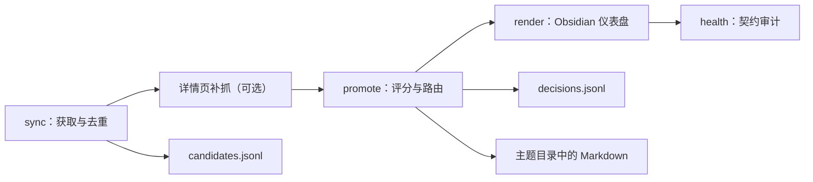

# 架构说明

KnowledgeFlow 把知识流入分成四个可独立运行的阶段：

## 设计原则

- **文件即状态机**：候选与决策使用追加式 JSONL，人可以直接检查和备份。
- **幂等**：规范化 URL 的哈希是候选 ID；同一 URL 不会重复进入候选箱。
- **删除防回流**：文章生成时立即写入决策账本，后续即使删掉 Markdown 也不再生成。
- **重试可审计**：详情页补抓不会覆盖历史拒绝记录，而是追加 `requeued` 事件，再产生新的终态决策。
- **非秘密配置**：主题、来源与门槛进入版本控制，运行数据和私密覆盖配置被忽略。
- **证据优先**：自动文章只陈述来源发布了什么，不将摘要升级成独立事实。
- **低依赖**：核心只使用 Python 标准库；失败点主要是外部来源的网络健康。

## 质量分

综合分由来源权威性 35%、主题相关性 30%、时效性 20%、结构完整性 15% 构成。评分是信息分流启发式，不是事实真实性证明。

## 可扩展边界

需要站点专用列表解析、全文提取、向量搜索或 LLM 综合时，建议作为独立处理阶段接在候选账本之后，并将输出写入新的中间文件。详情页补抓只做确定性的证据摘要，不负责判断事实真伪；不要把非确定性模型调用混进抓取与决策账本，以免难以重试和审计。
